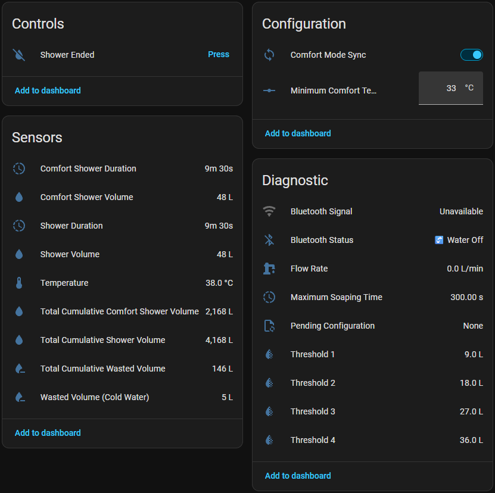

 

# Hydrao Custom for Home Assistant 🚿

A **100% local integration for Home Assistant** that talks directly over Bluetooth Low Energy (BLE) with your Hydrao shower device, to track your water usage shower after shower, with zero Cloud dependency. 🛡️

> ℹ️ **Good to know**: This integration queries the Hydrao device directly over Bluetooth while the water is running — that's what lets it read data and send settings live to the device.

If this project is useful to you, you can support its development 🙏

---

## ⚡ At a Glance
- 🔌 100% local operation over Bluetooth (BLE)
- 🏠 Home Assistant compatible (no cloud)
- 🚿 Detailed tracking for every shower: Volume, duration, wasted cold-water volume
- 🔄⭐ Comfort Mode Sync: Automatically resets the device's counter as soon as the water reaches the defined Minimum Comfort Temperature
- 🎨 Set the 4 liter thresholds and pick their colors via a built-in color picker
- 🌡️ Minimum Comfort Temperature adjustable in Home Assistant (never sent to the Hydrao device)
- 🔘 "Shower Ended" button to manually close out a shower or trigger it via an automation (e.g. Hey Google, Shower Ended "Name") — an `input_boolean` may be needed to link it to Google Assistant
- ⚙️ HACS installation in 2 minutes

---

## 📸 Examples in Home Assistant

### 🔍 Technical Details

  

  <em>🔍 Entities exposed by the integration & ⚙️ Advanced configuration options</em>

---

### 💡 Why This Integration?
This integration talks directly to your Hydrao's BLE protocol for complete home-automation tracking, with no compromises:

* **🔒 100% local:** No internet connection required, data flows only from the shower to Home Assistant.
* **🚿 Precise per-shower tracking:** Volume, duration, and — most importantly — the cold-water volume wasted before the water reaches the right temperature.
* **🔄 Comfort Mode Sync:** Restarts the counter on the device as soon as the Minimum Comfort Temperature is reached, so the liter and color thresholds only reflect water that was actually comfortable — and therefore actually used.
* **🛡️ Longevity:** No dependency on a server or third-party app.

---

### ✅ Compatibility / Requirements
* 🏷️ **Supported models**: Hydrao devices broadcasting over Bluetooth (BLE) under an automatically detected name (`HYDRAO*`).
* 🏅 **Tested on**: Validated on the **Hydrao Aloé (HYDRA_SHOWER)**, Hardware version 9.
* 🛠️ **Required hardware**: Built-in Bluetooth adapter, USB Bluetooth dongle, or an **ESPHome Bluetooth Proxy** (recommended for range, [easy setup here](https://esphome.github.io/bluetooth-proxies/)).
* 💧 **Waking the device**: The Hydrao only communicates over Bluetooth while water is running — remember to run the water so the integration can read or write settings (thresholds, colors, soaping time).
* 📶 **Bluetooth signal**: A dedicated RSSI sensor lets you monitor signal quality live.

---

### ✨ Highlights
* 🔄⭐ **Comfort Mode Sync** (Switch): Automatically resets the device's counter as soon as the water reaches the defined Minimum Comfort Temperature — the flagship feature of this integration.
* 🏠 **100% Local (BLE)**: No Cloud dependency.
* 💧 **Detailed volumes**: Total cumulative volume, current shower volume, comfort volume, wasted volume (cold water) — both per session and cumulative total.
* ⏱️ **Detailed durations**: Duration of the current shower and time spent in the comfort zone.
* 🎨 **Thresholds & Colors**: Set the 4 liter thresholds and pick their colors via a built-in color picker, read and updated live on the device.
* 🌡️ **Minimum Comfort Temperature**: Adjustable in Home Assistant via a Number entity, with a validated range (0 - 50 °C) — this setting stays in Home Assistant and is never sent to the Hydrao device.
* 🧴 **Maximum Soaping Time**: Duration before the counters reset, adjustable (10 to 600 seconds).
* 🔘 **"Shower Ended" button**: Manually ends the current count without waiting for the water to shut off. Tip: an `input_boolean` may be needed to link this button to Google Assistant.
* 🔵 **Detailed Bluetooth status**: Water Off, Connecting, Connected, Error, Sending Configuration, Configuration Applied, Failed, or Restarting Device.
* 📋 **Pending Configuration**: Shows at a glance whether any settings (thresholds, colors, soaping time) haven't been sent to the device yet.
* 📶 **Live Bluetooth signal** via passive listening, without polling the device or draining its battery.
* 🔧 **Diagnostics**: Firmware, Hardware, and Unique Identifier of the device, exposed at the device level.
* ⚙️ **100% UI configuration**: Automatic Bluetooth discovery or manual setup by MAC address, everything is configured from the Home Assistant interface.
* 🔄 **Factory reset** available directly from the options.

---

### 🚀 Installation

#### Via HACS (Recommended)
Since this repository isn't (yet) in the official default list, you'll need to add it as a custom repository.

1. Open **HACS** in your Home Assistant.
2. Click the 3 dots in the top right and select **Custom repositories**.
3. In **Repository**, paste the URL: `https://github.com/Adrien40/ha-hydrao-custom`
4. In **Type**, choose **Integration**, then click **Add**.
5. Once added, a window appears: click **Download** (select the latest version).
6. **Fully restart Home Assistant**.
7. Go to **Settings** > **Devices & Services** > **Add Integration** and search for "Hydrao Custom".

#### Manual
Copy the `custom_components/hydrao_custom` folder into the `custom_components` folder of your Home Assistant configuration, then restart.

---

### 📊 Available Sensors and Controls
| Entity | Unit / Type | Description |
| :--- | :--- | :--- |
| 🔘 **Shower Ended** | Button | Manually ends the count for the current shower. |
| ⏱️ **Shower Duration** | min | Raw duration of the current shower. |
| ⏱️ **Comfort Shower Duration** | min | Time spent in the comfort zone. |
| 🌡️ **Temperature** | °C | Water temperature measured live. |
| 🚿 **Shower Volume** | L | Raw volume of the current shower. |
| 💧 **Comfort Shower Volume** | L | Volume used once the comfort temperature is reached, for the current shower. |
| 💧 **Total Cumulative Comfort Shower Volume** | L | Historical total of the volume used once the comfort temperature is reached. |
| 💧 **Total Cumulative Shower Volume** | L | Total volume accumulated since installation. |
| ❄️ **Wasted Volume (Cold Water)** | L | Volume wasted before reaching the comfort temperature, for the current shower. |
| ❄️ **Total Cumulative Wasted Volume** | L | Historical total of the wasted cold-water volume. |
| 🔄 **Comfort Mode Sync** | Switch | Enables automatic reset as soon as comfort is reached. |
| 🌡️ **Minimum Comfort Temperature** | Number (°C) | Adjustable comfort threshold (0 - 50 °C). |
| 📋 **Pending Configuration** | Status | Setting(s) awaiting delivery to the device (None, Soaping, Thresholds, Colors, or combinations). |
| 💨 **Flow Rate** | L/min | Instantaneous water flow rate. |
| 🧴 **Maximum Soaping Time** | s | Maximum soaping time currently configured, as read from the device. |
| 🔵 **Bluetooth Status** | Status | Water Off / Connecting / Connected / Error / Sending Configuration / Configuration Applied / Failed / Restarting Device. |
| 🟢🔵🩷🔴 **Threshold 1 to 4** | L | The 4 liter tiers configured on the device, with their color as an attribute. |
| 📶 **Bluetooth Signal** | dBm | Real-time received Bluetooth signal strength. |

ℹ️ *The device's Firmware, Hardware, and Unique Identifier are exposed by Home Assistant at the device level*

---

## 🚀 Configuration
1. Go to **Settings** > **Devices & Services**.
2. **If the water is running and the Hydrao device is in range**, Home Assistant detects it automatically: open the discovery notification and follow the wizard. **Otherwise**, click **Add Integration**, search for **Hydrao Custom**, then enter the device's MAC address manually.
3. Either way, you can set the Minimum Comfort Temperature at this step.

### ⚙️ Options
Once the device is added, click **Configure** ⚙️ to:
* Adjust the Minimum Comfort Temperature, Maximum Soaping Time, and Comfort Mode Sync.
* Change the 4 liter thresholds and their colors (only once a first connection has been established — run the water to wake the device).
* Reset to factory defaults in one click.

> ⚠️ **Water must be running** when you submit the form for the new thresholds to be sent to the device. If it isn't, the status will show **"🚰 Water Off"** and the setting will remain visible in the **Pending Configuration** sensor until the next shower — and if the transfer still fails once the water is back on, the integration will automatically retry on the following shower.

---

### 🐛 Troubleshooting

⚠️ See common issues

* **"Water Off" permanently**: Normal — the Hydrao only communicates over Bluetooth while water is running.
* **"Connection Error"**: Unlike "Water Off", this status means the device was detected in range, but the connection or read still failed (signal too weak or unstable, dropped mid-shower). Move your antenna closer, or [install an ESPHome Bluetooth Proxy](https://esphome.github.io/bluetooth-proxies/) near the shower.
* **"Configuration Failed"**: Writing the new settings to the device failed after several attempts. No need to worry: the change isn't lost (visible in **Pending Configuration**), it will be automatically retried at the next shower.
* **Thresholds/Colors greyed out in options**: They can only be read/edited after a successful first connection — run the water once before adjusting them.

---

### 🤝 Contributing & Support
For any bug or feature request, please open an [Issue](https://github.com/Adrien40/ha-hydrao-custom/issues) on this repository.

### ⚖️ License & Disclaimer
Project licensed under **GPLv3**. This is an independent project with no affiliation to the Hydrao company. Use of this software is at your own responsibility.

---

**Developed with ❤️ by @Adrien40**

<!-- Keywords: Home Assistant custom integration, BLE sensor, water saving, shower monitoring, local control -->
